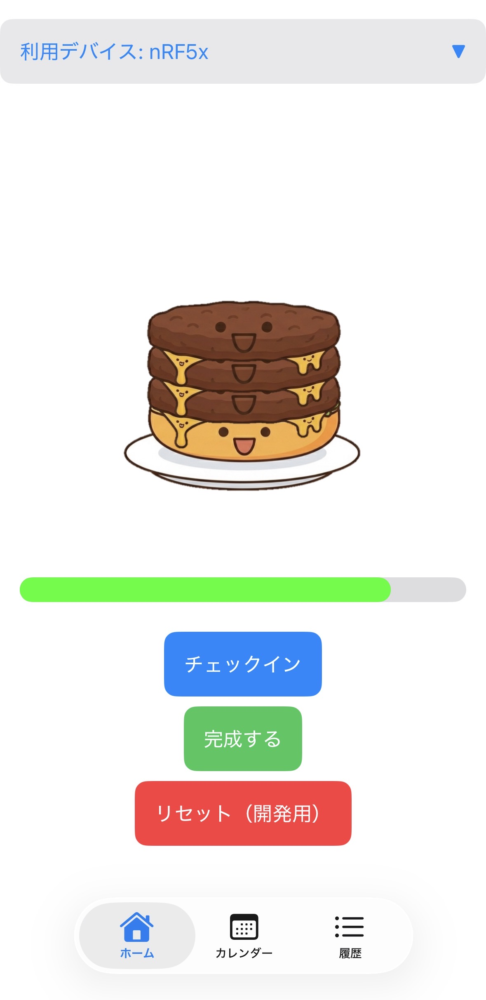

# Burger Log 🍔

## 概要

Burger Logは，BLEビーコンを用いたチェックイン型の習慣化支援iPhoneアプリです．

勉強机や研究室のデスクなど，継続したい行動を行う場所にBLEビーコンを設置し，その場所に近づいたときだけチェックインできるようにしています．チェックインするとハンバーガーのパティが1枚追加され，日々の継続を視覚的に楽しめるようにしました．

一般的な習慣化アプリでは，ユーザーが自己申告で記録することが多いですが，本アプリでは「特定の場所に行く」という実際の行動と記録を結びつけることを目指しました．

## 開発背景

卒業研究でBLEビーコンのRSSIを用いた屋内位置推定に取り組む中で，研究で扱っている技術を日常的に使えるアプリへ応用したいと考えました．

GPSでは判定しにくい机や部屋単位の近接判定に対して，BLEビーコンのRSSIを用いることで，特定の場所に近づいたかどうかを判定できる可能性があります．そこで，BLEを用いて「その場所に行ったら記録できる」仕組みを作り，習慣化を支援するアプリとして開発しました．

## 主な機能

- BLEビーコンの検出
- RSSIを用いた近接判定
- 近接時のみチェックインボタンを有効化
- チェックインによるハンバーガーのパティ追加
- カレンダーによる継続記録の表示
- チェックイン履歴の保存

## 使用技術

- Swift
- SwiftUI
- CoreBluetooth
- UserDefaults
- Xcode

## 画面例

### タイトル画面

### チェックイン画面

## 工夫した点

### RSSIを用いた近接判定

BLEビーコンから取得できるRSSIは，距離だけでなく端末の向きや周囲の環境によっても変動します．そのため，単にビーコンを検出しただけでチェックイン可能にするのではなく，実際に距離を変えながらRSSIの変化を確認し，チェックイン可能とする閾値を調整しました．

これにより，「ビーコンの近くに行ったときだけ記録できる」という体験を実現することを意識しました．

### 習慣化を楽しくするUI

継続日数を数字で表示するだけではなく，チェックインするたびにハンバーガーのパティが積み上がるUIにしました．記録を義務的な作業にするのではなく，見た目の変化によって継続を楽しめるように工夫しました．

### 研究技術のアプリへの応用

卒業研究で扱っているBLE/RSSIの知識を，実験や評価に留めるのではなく，ユーザーの行動を支援するアプリとして活用しました．研究で学んだ技術を，実際のプロダクト体験に落とし込むことを意識して開発しました．

## 今後の改善案

- RSSIの変動を考慮したより安定した近接判定
- チェックイン履歴の詳細表示
- 複数ビーコンへの対応
- 通知機能の追加
- 継続状況をより楽しく見せる演出の追加
